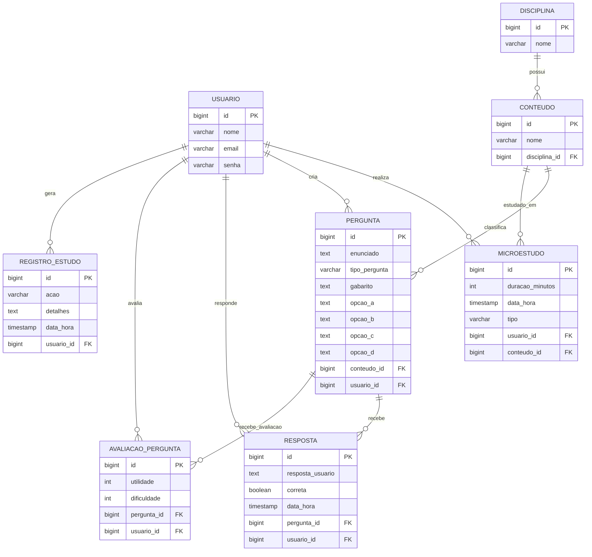

# Estudai
## Diagrama ER da aplicação

```mermaid
erDiagram
USUARIO {
bigint id PK
varchar nome
varchar email
varchar senha
}

    DISCIPLINA {
        bigint id PK
        varchar nome
    }
    
    CONTEUDO {
        bigint id PK
        varchar nome
        bigint disciplina_id FK
    }
    
    MICROESTUDO {
        bigint id PK
        int duracao_minutos
        timestamp data_hora
        varchar tipo
        bigint usuario_id FK
        bigint conteudo_id FK
    }
    
    PERGUNTA {
        bigint id PK
        text enunciado
        varchar tipo_pergunta
        text gabarito
        text opcao_a
        text opcao_b
        text opcao_c
        text opcao_d
        bigint conteudo_id FK
        bigint usuario_id FK
    }
    
    RESPOSTA {
        bigint id PK
        text resposta_usuario
        boolean correta
        timestamp data_hora
        bigint pergunta_id FK
        bigint usuario_id FK
    }
    
    AVALIACAO_PERGUNTA {
        bigint id PK
        int utilidade
        int dificuldade
        bigint pergunta_id FK
        bigint usuario_id FK
    }
    
    REGISTRO_ESTUDO {
        bigint id PK
        varchar acao
        text detalhes
        timestamp data_hora
        bigint usuario_id FK
    }

    DISCIPLINA ||--o{ CONTEUDO : "possui"
    CONTEUDO ||--o{ PERGUNTA : "classifica"
    CONTEUDO ||--o{ MICROESTUDO : "estudado_em"
    USUARIO ||--o{ MICROESTUDO : "realiza"
    USUARIO ||--o{ PERGUNTA : "cria"
    USUARIO ||--o{ RESPOSTA : "responde"
    USUARIO ||--o{ AVALIACAO_PERGUNTA : "avalia"
    USUARIO ||--o{ REGISTRO_ESTUDO : "gera"
    PERGUNTA ||--o{ RESPOSTA : "recebe"
    PERGUNTA ||--o{ AVALIACAO_PERGUNTA : "recebe_avaliacao"
```